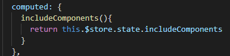

##### vue项目搭建步骤
```html
$ vue init webpack my-project
$ cd my-project
$ npm install
$ npm run dev
// 使用scss
    npm install  sass-loader -D
    npm install  node-sass -D
// 如果需要全局引入.scss文件的配置
    npm install  sass-resources-loader -D
    在项目里找到build/utils文件 如下修改
```
##### vue-cli 3.0 搭建Vue项目

```
1. 安装vue-cli 3.0
   npm i @vue/cli -g
2. vue-cli搭建脚本文件
   vue create vue-test
```

##### git基本用法

```
1. git stash save
2. git pull
3. git stash pop
4. git add ./
5. git commit -m'xxx'
6. git push
// --------
git checkout ./  丢弃所有更改
git checkout -- 文件名  // 丢弃某个文件更改
// ------
7. 在当前项目中，早先创建并已经push到远程的文件及文件夹，将名称大小写更改后，git无法检测出更改。
出现这种情况的原因是，git默认配置为忽略大小写，因此无法正确检测大小写的更改。
那么，解决办法是，在当前项目中，运行git config core.ignorecase false，关闭git忽略大小写配置，即可检测到大小写名称更改。
// ----
8. git merge xxx 合并分支后有冲突（又不想合并了）
   使用 git merge --abort 回滚
```

##### iconfont 用法
```
- 引入
 <link rel="stylesheet" href="https://at.alicdn.com/t/font_1352771_ktvjvzhb1v.css">
- 使用
 <i class="iconfont ju-hk-count-down"></i>
```

##### 图片阴影实现案例
```
// html
<div class="shade__wrap">
    
</div>
// css
.shade{ 
    &__wrap{
        position: absolute;
        left: 0;
        top: 0;
        width: 100%;
        height: 100%;
        overflow: hidden;
        &__img{
            width: 100%;
            height: 100%;
            filter: blur(40px);
        }
    }
}
```
- 效果：


##### 对象的深拷贝方法
- Object
```js
  const a1 = {name: "", id: ""}
  const a2 = Object.assign({}, a1)
```
- Array 
```js
   es5:     const a1 = [1,2,3]
            const a2 = a1.concat(al)
   es6:     const a1 = [1,3,5,6]
            const a2 = [...a1] // [...a2] = a1
```

##### SPA页面缓存(包含接口)
- 在```App.vue``` 中加 ```keep-alive,keep-alive```的自由属性:

```js
  include: // 包含需要缓存的页面
  exclude: // 包含不需要缓存的页面
```


- 获取 需要缓存的页面（```includeComponents```）



- 在需要做缓存的页面加路由钩子函数


```js
   beforeRouterEnter(){ 
        // 添加需要缓存的页面
        this.$store.dispatch("ADD_INCLUDE_COMPONENT_ACTION", "Home")
   }
   beforeRouteLeave(){
       // 移除需要缓存的页面
       this.$store.dispatch("REMOVE_INCLUDE_COMPONENT_ACTION", "Home")
   }
```
- ```store```里面的逻辑


##### 如期转时间戳的兼容写法
```js
    let times = new Date('2019-10-16 14:23:59'.replace(/-/g, '/')).getTime()
```

##### vue提供的一些修饰符
```js
 // 1.阻止单击事件继续传播 ：
 <a @click.stop="doThis"></a> 
 // 提交事件不再重载页面 ：
 <form @submit.prevent="onSubmit"></form> 
 // 修饰符可以串联  ：
 <a @click.stop.prevent="doThat"></a> 
 // 只有修饰符  ：
 <form @submit.prevent></form> 
 // 添加事件监听器时使用事件捕获模式， 即元素自身触发的事件先在此处理，然后才交由内部元素进行处理 ：
 <div @click.capture="doThis">...</div> 
 // 只当在 event.target 是当前元素自身时触发处理函数 ，即事件不是从内部元素触发的 ：
 <div @click.self="doThat">...</div>
 // 遮罩层阻止默认滚动事件
 <div class="child" @touchmove.prevent ></div>
```

#### 正则解构路由URL
```js
    const regExp = /(\w+):\/\/([^/:]+)(:\d*)?([^# ]*)/;
    const arr = URL.match(regExp)
```
#### 更新安装包版本
```zh
    在以前可能就是直接改package.json里面的版本，然后再npm install了，但是5版本后就不支持这样做了，因为版本已经锁定在package-lock.json里了，所以我们只能npm install xxx@x.x.x  这样去更新我们的依赖，然后package-lock.json也能随之更新。
```

#### RSA加密工具
```js
    // 公钥例子
 const PUBLIC_KEY = `-----BEGIN PUBLIC KEY-----
	MIIBIjANBgkqhkiG9w0BAQEFAAOCAQ8AMIIBCgKCAQEAyvrVNCDKcN9sGujXqAdj
	a3L9hYl76Tx/hiWxCvtVE+kgUSZFOPpSHA0hbX3S/+fGh1kGR989IETLRNhn860W
	4WOrbtPFSFRQP1uGseH8Of3dU5v+XrZBVuhicSFXhfnGgJpig+Lkx
	tlGpy01H5XA2Q7iyi2Oa7BCrSx0sb/CfGjFpKTyEmQqkgUw3C2NJkgwjCG9CrJiI
	jt2W5xdhdazP3jPWRRemx5bE+GtkhvZETFErIkUb55vNiXc/rYZWOa3+SZpw8oey
	pQIDAQAB
        -----END PUBLIC KEY-----`
    // 安装 jsencrypt 
    import Rsa from "jsencrypt";
    // 创建加密实例
    const rsa = new Rsa();
    // 初始化公钥
    rsa.setPublicKey(PUBLIC_KEY)
    // 加密数据
    const data = rsa.setPublicKey(data)
```
