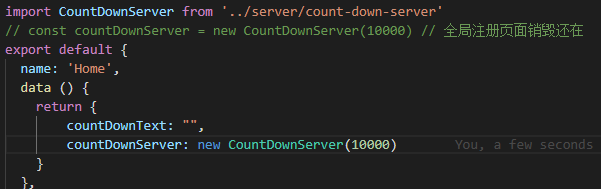

#### 开发常见问题

> 使用Axios时

```zh
    如果跨域页面会发两次请求
    第一个请求时，看不到请求参数，也看不到请求的结果(也叫options/OPTIONS请求)
    原因： 由于跨域会发生一次预请求后端校验确认允许跨源请求
    解决方案：暂未找到解决方案
```
> 使用map遍历

```zh
    存在的问题：没法跳出循环
```
> 使用图片时存在的问题

```zh
    没有事件或链接的img标签在手机上点击会变成查看大图
    解决方案：添加样式pointer-events：none;
```
> vue中父组件给子组件传值问题

```zh
    要注意组件加载顺序和数据异步，否则在子组件中用watch监听不到外部属性的变化，
    一般数据是接口请求回来的所以不会出现这种情况，但如果用的是本地数据赋的值就监听不到数据变化（外部属性的变化）。
    解决方案：可加个定时器模拟异步
```

> 列表定时器问题

```zh
    场景：商品限购倒计时
   方案：在倒计时里面循环数据，修改数据即可（可自行添加字段）
```

> 获取图片的颜色 getImageMeanColor

```zh
    canvas存在跨域如果图片跨域会导致吸取不到颜色
    设置 image.crossOrigin = 'anonymous';
```
> 父组件传入图片路径和路由给子组件(无效的坑)

```zh
  1. 如果图片是在 assets 文件夹下面的话，需要在路径前面加上     require 函数才行，否则 webpack 会识别不了路径报错
  2. 还可以把图片放到 static 文件夹下面，这样的话就不需要 require ，可以像原来传统的方式那样写,
  # 例：
  >>> navs: [{
            "name": "在/static目录中的图片",
            "imgPath": "../../../static/logo.png",
            "url":"/mine"
        },
        {
            "name": "在/assets目录中的图片",
            "imgPath": require("../../assets/logo.png"),
            "url":"/mine"
        }]
    <!-- 注释 -->
```
> transform 属性的使用

```zh
   1. 块状元素，行内块元素使用transform才会生效
```
> 实际项目中vue中watch用法

```zh
    子组件用watch监听外部属性时要注意组件先后加载顺序。
    例：如果父组件通过事件改变属性值时，并且用了v-if来控制子组件的显示，则子组件通过watch监听属性变化无效
    方案：用v-show控制子组件展示
```
> 自适应和响应式的区别

```zh
    自适应： 是为不同类别的设备建立不同的网页，检测到设备分辨率大小后调用相应的网页。
    响应式：是一套界面同时运行到pc端、平板、手机端各个不同的视口。通过检测设备的分辨率，来对页面做出不同的布局和内容。
```
> 关于h5获取经纬度存在的问题

```zh
    1. 如果网站是https的请求了http的一些资源，定位系统就会认为这个是不安全的，就会定位失败。
    可能出现的效果：如果先加载了http的资源定位就会失败，如果先定位了，请求的http资源就会失败。
```

> Meta 标签定义 参数解释

```zh
width = device-width：宽度等于当前设备的宽度

initial-scale： 初始的缩放比例（默认设置为1.0）

minimum-scale：允许用户缩放到的最小比例（默认设置为1.0）

maximum-scale：允许用户缩放到的最大比例（默认设置为1.0）

user-scalable：用户是否可以手动缩放（默认设置为no，因为我们不希望用户放大缩小页面）
```

> 常见的一些网页布局单位

```zh
px：绝对单位，页面按精确像素展示

em：相对单位，基准点为父节点字体的大小，如果自身定义了font-size按自身来计算（浏览器默认字体是16px），整个页面内1em不是一个固定的值。

rem：相对单位，可理解为”root em”, 相对根节点html的字体大小来计算，CSS3新加属性，chrome/firefox/IE9+支持。

(另外需注意chrome强制最小字体为12号，即使设置成 10px 最终都会显示成 12px，当把html的font-size设置成10px,子节点rem的计算还是以12px为基准，所以网上很多文章提到的将html的font-size设为10方便计算不是那么可取)。

rem在移动端应用可参考淘宝的页面http://m.taobao.com (html的font-size通过动态计算获取)

vw：viewpoint width，视窗宽度，1vw等于视窗宽度的1%。

vh：viewpoint height，视窗高度，1vh等于视窗高度的1%。

vmin：vw和vh中较小的那个。

vmax：vw和vh中较大的那个。

vw, vh, vmin, vmax：IE9+局部支持，chrome/firefox/safari/opera支持，iOS safari 8+支持，Android browser4.4+支持，chrome for android39支持
```

> 通过new Vue()实例传值时

```
    一定要销毁事件监听
```

> 滚动穿透

  现象：当弹层内上下滚动到顶部或底部时页面body也会一起滚动,  
  解决方案：在当弹层打开时给body添加class类
  
```js
    .prevent-scroll{
        position: fixed;
        height: 100%;
    }
    export function getPreventBodyScroll(bodyClass) {
        let scrollTop;
        return {
        prevent: function() {
            scrollTop = document.scrollingElement.scrollTop;
            console.log(document.scrollingElement)
            document.body.classList.add(bodyClass);
            document.body.style.top = -scrollTop + 'px';
        },
        recover: function() {
            document.body.classList.remove(bodyClass);
            document.scrollingElement.scrollTop = scrollTop;
        }
        };
    }
  // 使用：
    openDailog: getPreventBodyScroll.prevent('prevent-scroll');
    closeDailog: getPreventBodyScroll.recover('prevent-scroll');
```

> iOS上input框调起输入法的一些现象

  现象： input框调起输入法后页面不回退.<br>
  方案： input失去焦点时触发事件. ```@blur='temporaryRepair'```

```js
    export function temporaryRepair(){ // 解决iOS调出输入法后页面不回退的兼容问题
        let currentPosition,timer;
        let speed=1;//页面滚动距离
        timer=setInterval(function(){
            currentPosition=document.documentElement.scrollTop || document.body.scrollTop;
            currentPosition-=speed;
            window.scrollTo(0,currentPosition);//页面向上滚动
            currentPosition+=speed; //speed变量
            window.scrollTo(0,currentPosition);//页面向下滚动
            clearInterval(timer);
        },1);
    }
```
> 翻牌功能开发遇到的兼容问题

  现象：旋转.<br>
  思路：http://webfront-js.com/articaldetail/129.html

> 两种方式的区别



> 精度缺失
```
 parseInt(1111.11 * 100) // 111110
 parseFloat(1111.11 * 100).toFixed(0) // 111111

```
> 小程序通过```getPhoneNumber```获取手机号
```js
    // 用户拒接两端不同报错提示 detail.errMsg
    ios: "getPhoneNumber:fail user deny"
    Android: "getPhoneNumber:user deny"
    // 允许
    统一: "getPhoneNumber:ok"
```
> 采用 overflow-y:auto 的滚动问题
```zh
    问题： 在一些手机上滚动不流畅
    方案： 在设置了overflow-y:auto的dom上加样式 -webkit-overflow-scrolling:touch;
    风险：某些设置 position: fixed 的dom会跟着一起滚动，解决方案视布局而定
    例：设置 position: fixed 和 overflow-y:的dom不能在同一级
```
> 实现点透功能
```zh
 问题： 有些功能需要实现点击上层DOM下层DOM接受到事件
 方案：给上层DOM添加样式：pointer-events: none;
```
> 小程序中两个js文件相互引用会导致栈溢出现象（应尽量避免）

> iPhoneX底部兼容
```css
@supports (bottom: constant(safe-area-inset-bottom)) or (bottom: env(safe-area-inset-bottom)) {
    .clazz{
	  padding-bottom: calc(env(safe-area-inset-bottom) / 2);
	}
}
```
